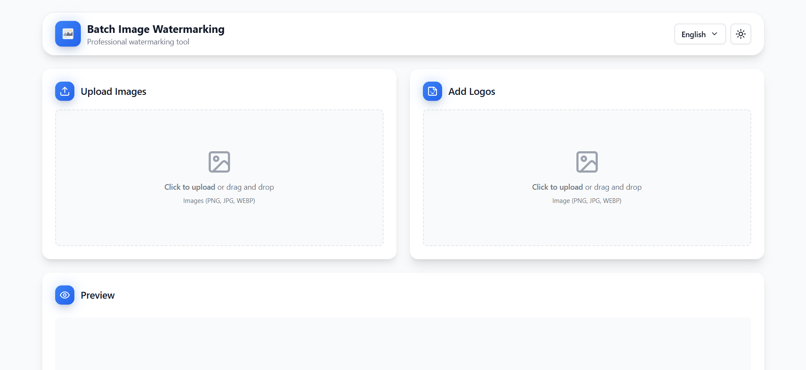
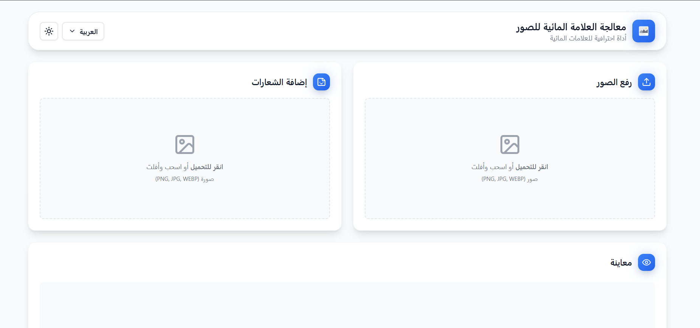
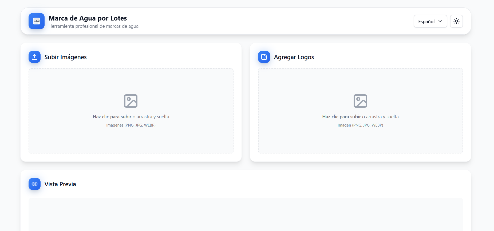
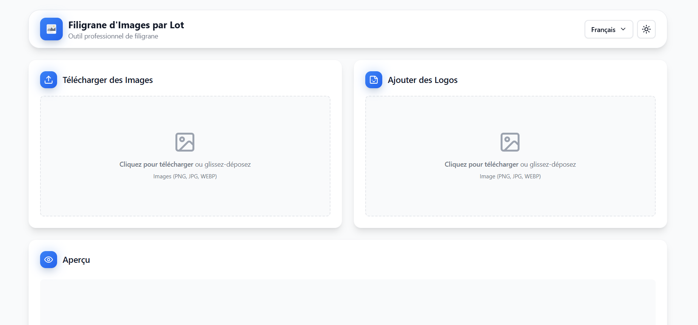
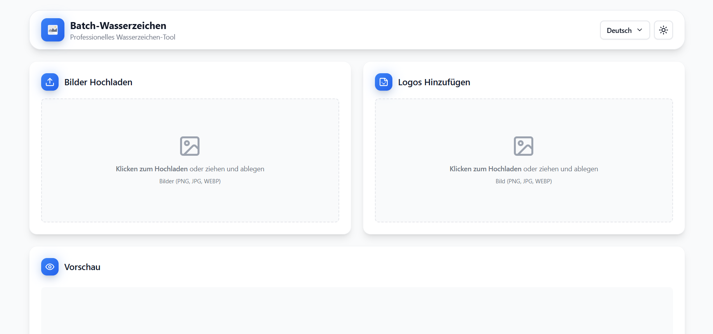
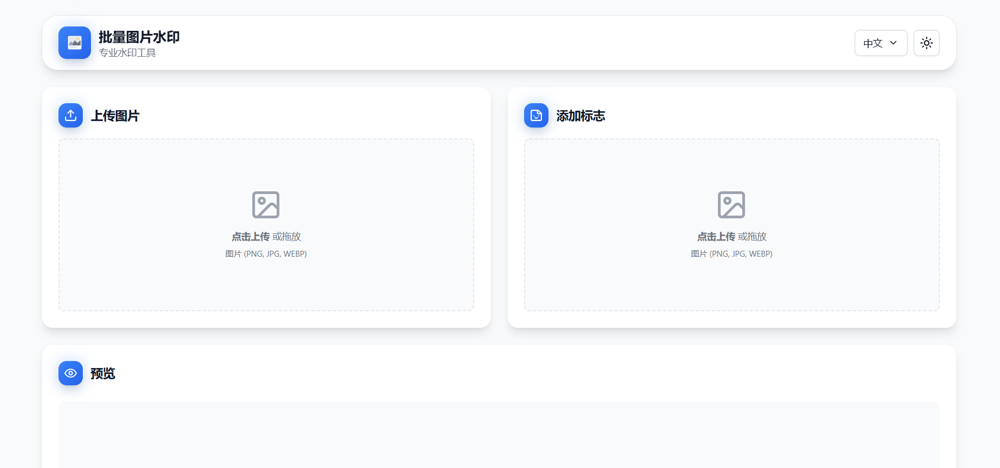
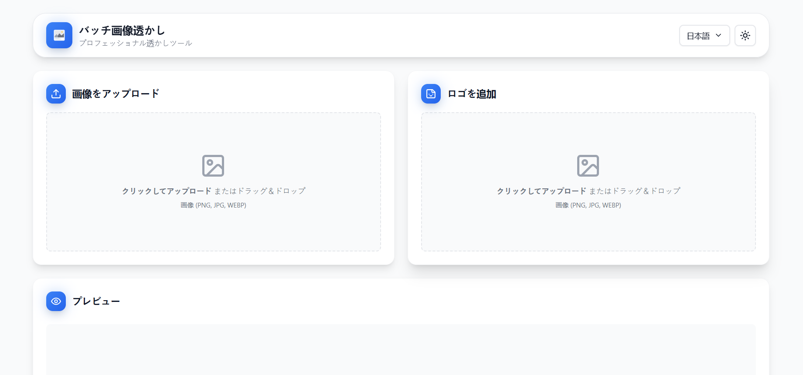

<div align="center">

# Batch Image Watermarking App

Lightweight, fast, and polished desktop app for adding watermarks to images in batch. Built with React + Tauri for native performance.

<p>
  
</p>

<p>
  
</p>

<p>
  
</p>

[](https://react.dev)
[](https://vitejs.dev)
[](https://tauri.app)
[](https://www.typescriptlang.org)
[](https://tailwindcss.com)
[](https://zustand-demo.pmnd.rs)

</div>

## Highlights

- 🖼️ Batch processing: upload and process multiple images at once
- 🎨 Multiple logos: precise positioning, opacity, size, and rotation
- 🔄 Pattern mode: repeat watermark across the image grid
- 🌓 Theme: light/dark with matching gradient background across app
- 🌍 Internationalization: 7 languages with fixed LTR language chips
- ⚡ Native-speed: Tauri desktop build with minimal footprint

## Screenshots

<p>
  
  
</p>

<p>
  
  
</p>

<p>
  
  
</p>

<p>
  
</p>

## Quick Start

```bash
# Install dependencies
npm install

# Web preview (Vite)
npm run dev

# Desktop preview (Tauri)
npm run tauri dev

# Production builds
npm run build         # Web build (dist/)
npm run tauri build   # Desktop build (src-tauri/target/release)
```

## Usage

1. Upload images (click or drag & drop)
2. Add one or more logo files
3. Configure positions, opacity, size, and rotation
4. Toggle Pattern Mode for grid-style watermarks
5. Export to download processed images

## Design & UX

- Consistent gradient background for both landing and app screens
- Desktop header shows Theme (left), centered logo, Language (right)
- Mobile header uses a clean hamburger menu containing Theme and Language
- Arabic RTL respected throughout; language chips remain LTR by design
- Smooth hover/press states, compact yet accessible touch targets

## Tech Stack

- Frontend: React 18 + TypeScript, Vite 5
- Desktop: Tauri 2.0
- Styling: Tailwind CSS 3
- State: Zustand
- Drag & Drop: @dnd-kit
- Icons: Lucide React

## Project Structure

```
src/
├── components/       # React components
│   ├── ImageDropzone.tsx
│   ├── ImagePreview.tsx
│   ├── LogoList.tsx
│   └── WelcomePage.tsx
├── hooks/            # Custom React hooks
├── store/            # Zustand stores (images, language)
├── lib/              # utils, i18n, confetti
├── constants/        # App constants (theme, etc.)
├── types/            # Type definitions
├── App.tsx           # App shell
├── main.tsx          # Entry point
└── index.css         # Global styles

src-tauri/            # Tauri project (desktop)
```

## Internationalization

- Languages: EN, AR, ES, FR, DE, ZH, JA
- Add new keys in `src/lib/i18n/translations.ts`
- UI switches `dir="rtl"` for Arabic while keeping language chips LTR

## Theming

- Light/Dark toggle available in header and mobile menu
- Background unified via global body gradient (light and dark)

## Contributing

See [CONTRIBUTING.md](CONTRIBUTING.md) for standards, commit style, and PR flow.

## Security

See [SECURITY.md](SECURITY.md) to report vulnerabilities.

## Changelog

See [CHANGELOG.md](CHANGELOG.md) for release notes.

## License

MIT
